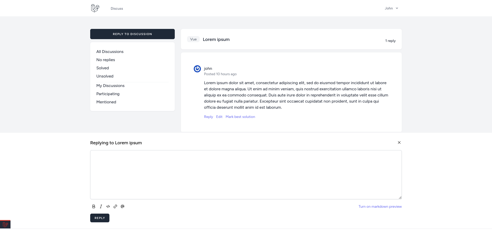
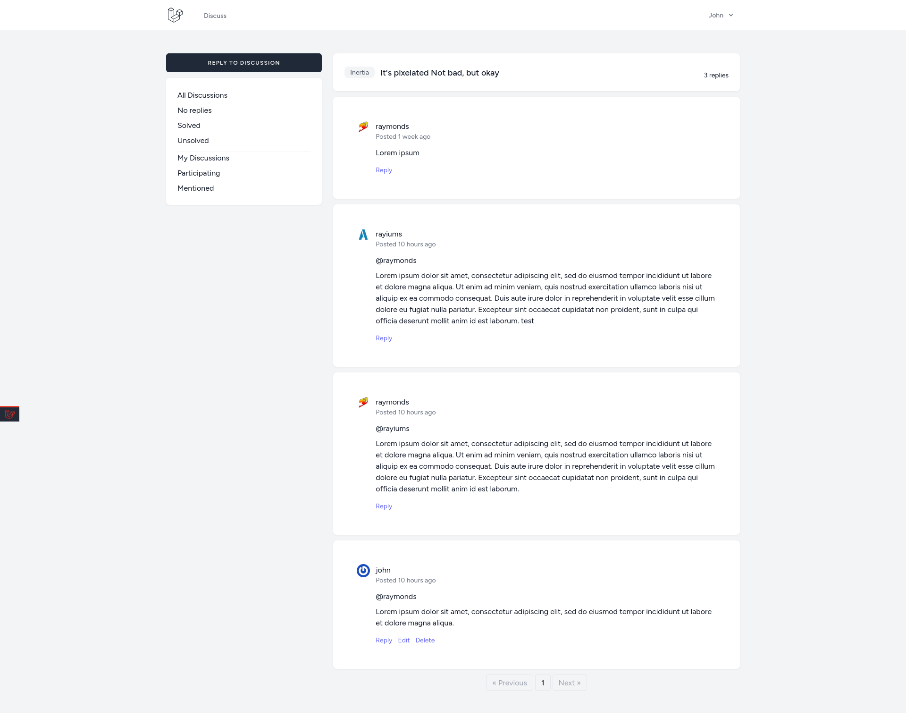

# Discuss

This project is a modern and user-friendly forum application developed using cutting-edge web technologies. The forum provides comprehensive features for creating online communities, facilitating discussions, and enabling users to exchange ideas and opinions.

# Installation

```bash
git clone https://github.com/Rayiumir/Discuss.git
cd Discuss/
composer install
npm install
cp .env.example .env
php artisan migrate --seed
php artisan key:generate
php artisan serve
npm run dev
```

# Screenshots

<table class="table">
  <thead>
    <tr>
      <th scope="col" width="1000px">Dashboard</th>
      <th scope="col" width="1000px">Best Answer</th>
      <th scope="col" width="1000px">Discuss Index</th>
    </tr>
  </thead>
  <tbody>
    <tr>
      <td>
        
      </td>
      <td>
        
      </td>
      <td>
        
      </td>
    </tr>
  </tbody>
</table>

<table class="table">
  <thead>
    <tr>
      <th scope="col" width="1000px">New Discussion</th>
      <th scope="col" width="1000px">Discuss Replying</th>
      <th scope="col" width="1000px">Discuss Single</th>
    </tr>
  </thead>
  <tbody>
    <tr>
      <td>
        
      </td>
      <td>
        
      </td>
      <td>
        
      </td>
    </tr>
  </tbody>
</table>
